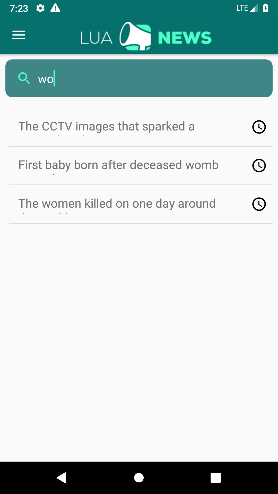
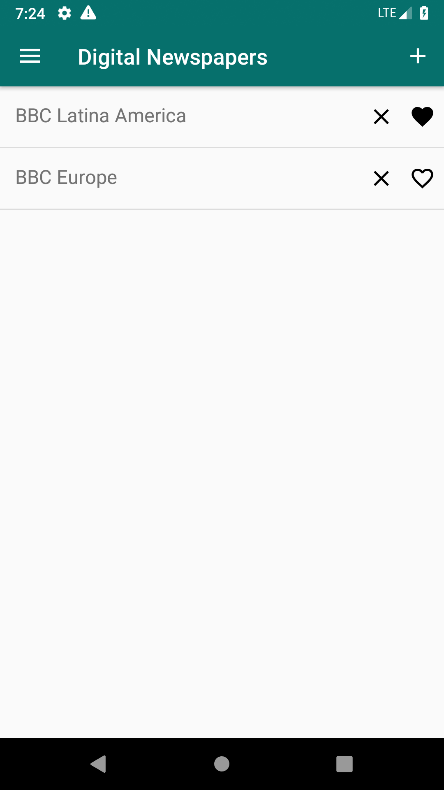
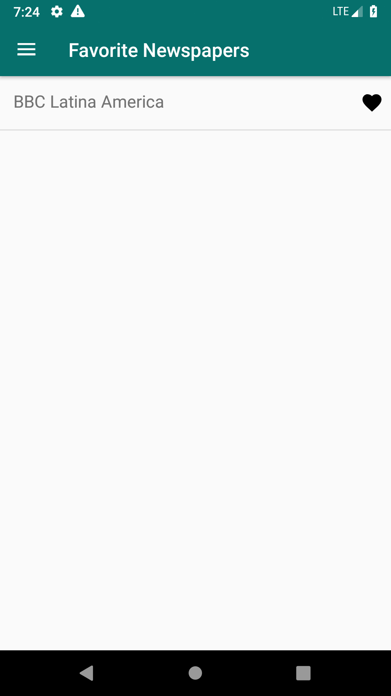
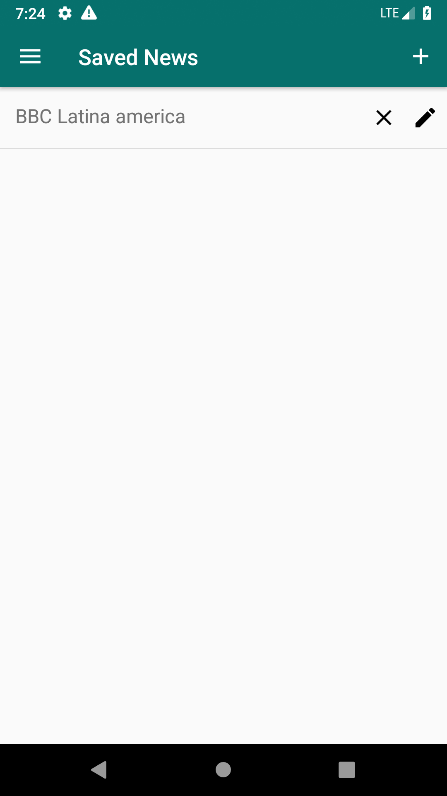
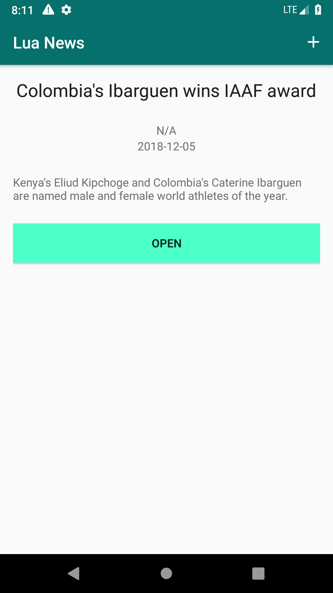
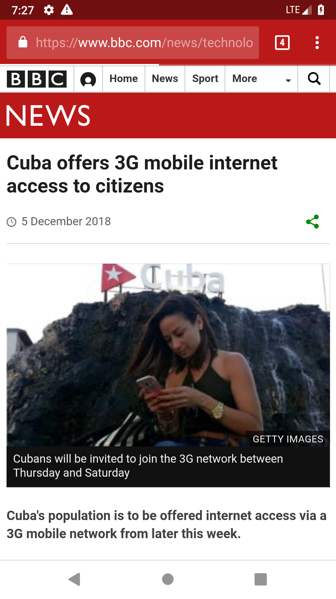

# Lua News  

## Description

Lua News is an Android application that uses RSS to gather news from electronic newspapers. This project was developed as a work for the Development of Systems for Mobile Devices course. In this application the user can add RSS feeds from newspapers that he or she is interested in and receive news from these feeds. In addition, you can favor channels, create news lists, save news in these lists, and add news to news list to be read later. Other features have been implemented as course requirements such as user login.

## App Preview

	

		
		
		
		
		
		
		
		
		
		
		
		
		
		
		
		
	

## Author

 |
---|
[Breno Viana](https://github.com/brenov) |

## Designer

 |
---|
[Pedro Cavalcante](https://www.behance.net/pedrocavalcante) |
